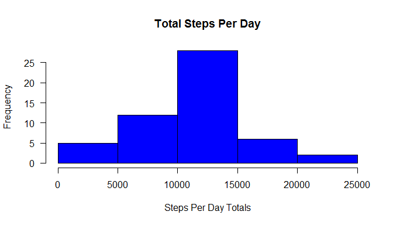
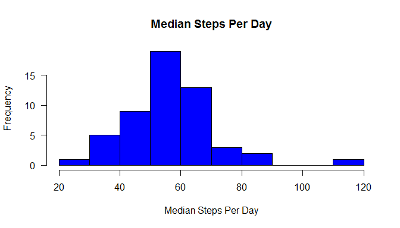

# Reproducible Research: Peer Assessment 1


## Loading and preprocessing the data

```r
library(dplyr)
library(ggplot2)
library(timeDate)
wd <- 'C:/Users/Michał.Michał-PC/Documents/reproducible_research/'
setwd(wd)

### LOADING AND PROCESSING DATA ###
rawData <- read.csv(paste(wd, 'activity.csv', sep=''), header = TRUE, na.strings = "NA")
data <- filter(rawData, steps != 'NA')
data$date <- as.Date(data$date)
head(data, n=10)
```

```
##    steps       date interval
## 1      0 2012-10-02        0
## 2      0 2012-10-02        5
## 3      0 2012-10-02       10
## 4      0 2012-10-02       15
## 5      0 2012-10-02       20
## 6      0 2012-10-02       25
## 7      0 2012-10-02       30
## 8      0 2012-10-02       35
## 9      0 2012-10-02       40
## 10     0 2012-10-02       45
```


## What is mean total number of steps taken per day?


```r
# Constructing data - for median I'm omitting 0 as otherwise most median values for days would be 0
sumByDay <- data %>% group_by(date) %>% summarize(total_steps=sum(steps), mean_steps=mean(steps), median_steps=median(steps[steps>0]))
head(sumByDay)
```

```
## Source: local data frame [6 x 4]
## 
##         date total_steps mean_steps median_steps
##       (date)       (int)      (dbl)        (dbl)
## 1 2012-10-02         126    0.43750         63.0
## 2 2012-10-03       11352   39.41667         61.0
## 3 2012-10-04       12116   42.06944         56.5
## 4 2012-10-05       13294   46.15972         66.0
## 5 2012-10-06       15420   53.54167         67.0
## 6 2012-10-07       11015   38.24653         52.5
```

The total steps by day


```r
#total
hist(sumByDay$total_steps, 
    main = 'Total Steps Per Day',
    xlab = 'Steps Per Day Totals',
    ylab = 'Frequency',
    col = 'blue',
    las = 1)
```

<!-- -->

The mean steps by day


```r
hist(sumByDay$mean_steps, 
    main = 'Mean Steps Per Day',
    xlab = 'Mean Steps Per Day',
    ylab = 'Frequency',
    col = 'blue',
    las = 1)
```

<!-- -->

The median steps by day


```r
hist(sumByDay$median_steps, 
    main = 'Median Steps Per Day',
    xlab = 'Median Steps Per Day',
    ylab = 'Frequency',
    col = 'blue',
    las = 1)
```

<!-- -->


## What is the average daily activity pattern?


```r
### WHAT IS THE AVERAGE DAILY ACTIVITY PATTERN?

sumByInterval <- data %>% group_by(interval) %>% summarize(total_steps=sum(steps), mean_steps=mean(steps))
head(sumByInterval)
```

```
## Source: local data frame [6 x 3]
## 
##   interval total_steps mean_steps
##      (int)       (int)      (dbl)
## 1        0          91  1.7169811
## 2        5          18  0.3396226
## 3       10           7  0.1320755
## 4       15           8  0.1509434
## 5       20           4  0.0754717
## 6       25         111  2.0943396
```

Average steps in intervals


```r
plot(sumByInterval$interval, sumByInterval$mean_steps, type = "l", ylab='Average steps by Interval', xlab='')
```

<!-- -->

Maximum steps in an interval


```
## Source: local data frame [1 x 3]
## 
##   interval total_steps mean_steps
##      (int)       (int)      (dbl)
## 1      835       10927   206.1698
```


## Imputing missing values


```r
### IMPUTING MISSING VALUES ###
cleanData <- filter(rawData, complete.cases(rawData))

#missing rows
missingRows <- nrow(rawData) - nrow(cleanData)
```

Rows with NAs:


```
## [1] 2304
```

Below is the code that imputs missing values to the data set:

1. Filtering the original data set for incomplete rows and assigning to a new data frame
2. Replacing the missing steps with the means for intervals (reusing the sumByInterval data frame which was created for time series plot)
3. Pasting the imputed data with the data frame created after NA values were removed from the original data
4. Ordering the data by date and interval


```r
#imputing data
inputData <- filter(rawData, !complete.cases(rawData))
inputData$steps <- replace(inputData$steps, inputData$interval %in% sumByInterval$interval, sumByInterval$mean_steps)

finalData <- rbind(cleanData, inputData) %>% arrange( date, interval)
finalData$date <- as.Date(finalData$date)
head(finalData, n=10)
```

```
##        steps       date interval
## 1  1.7169811 2012-10-01        0
## 2  0.3396226 2012-10-01        5
## 3  0.1320755 2012-10-01       10
## 4  0.1509434 2012-10-01       15
## 5  0.0754717 2012-10-01       20
## 6  2.0943396 2012-10-01       25
## 7  0.5283019 2012-10-01       30
## 8  0.8679245 2012-10-01       35
## 9  0.0000000 2012-10-01       40
## 10 1.4716981 2012-10-01       45
```

Histogram:


```r
#histogram
sumByDay2 <- finalData %>% group_by(date) %>% summarize(total_steps=sum(steps), mean_steps=mean(steps), median_steps=median(steps[steps>0]))

hist(sumByDay2$total_steps, 
    main = 'Total Steps Per Day',
    xlab = 'Steps Per Day Totals',
    ylab = 'Frequency',
    col = 'blue',
    las = 1)
```

<!-- -->

Comparison before and after imputing data (all data with imputed values vs raw data without NAs):


```r
v1 <- c(mean(finalData$steps), median(finalData$steps), sum(finalData$steps))
v1
```

```
## [1]     37.3826      0.0000 656737.5094
```


```r
v2 <- c(mean(cleanData$steps), median(cleanData$steps), sum(cleanData$steps))
v2
```

```
## [1]     37.3826      0.0000 570608.0000
```

Above, we can see, that median and mean are the same but the total steps count is significantly higher. The median is the same, since there are a lot of 0 in the data. The mean is the same, since I used means for imputing data. 

## Are there differences in activity patterns between weekdays and weekends?


```r
### ARE THERE DIFFERENCES IN ACTIVITY PATTERNS BETWEEN WEEKDAYS AND WEEKENDS ###

sumByDay3 <- finalData %>% group_by(date) %>% summarize(total_steps=sum(steps), mean_steps=mean(steps), median_steps=median(steps[steps>0])) %>%
  mutate(day_type = ifelse(isWeekday(date, wday=1:5), 'weekday', 'weekend'))


ggplot(sumByDay3, aes(date, mean_steps)) + geom_line() + facet_grid(day_type ~ .) + xlab('') + ylab('Mean steps')
```

<!-- -->

